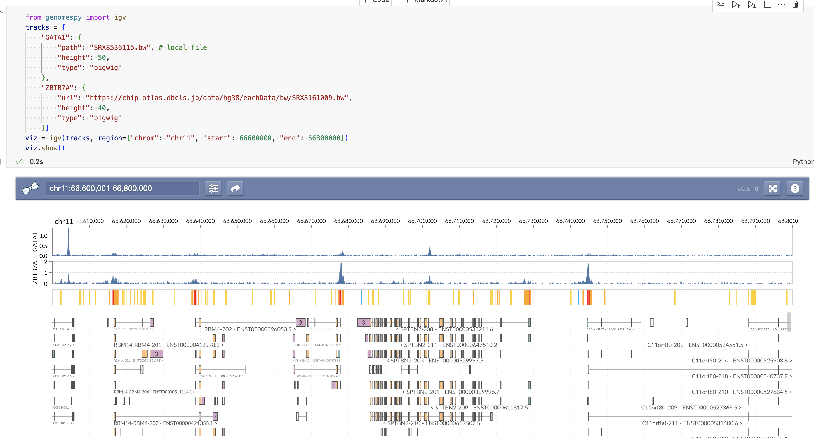

# GenomeSpy

[](https://pypi.org/project/genomespy)
[](https://pypi.org/project/genomespy)
[](https://genomespy.readthedocs.io/en/latest/?badge=latest)

GenomeSpy is a Python wrapper for the JavaScript visualization grammar library [GenomeSpy](https://genomespy.app). It enables the creation of interactive, GPU-accelerated genomic visualizations through a declarative grammar.



The Python package provides a high-level interface to create GenomeSpy visualizations. Under the hood, it:

- Generates JSON specifications that GenomeSpy can interpret
- Creates a temporary HTTP server to serve local data files
- Handles rendering in Jupyter notebooks by creating temporary HTML files
- Supports exporting standalone HTML files for sharing (note: referenced data files must remain accessible)

The javascript (official) version of GenomeSpy is developed in The Systems Biology of Drug Resistance in Cancer group at the University of Helsinki by [Kari Lavikka](https://github.com/tuner). Original repo is at [genome-spy/genome-spy](https://github.com/genome-spy/genome-spy). 

> **Note**: This package has been primarily tested with the hg38 (GRCh38) human genome assembly. While it may work with other assemblies, full compatibility is not guaranteed. PRs are welcomed!

## Features

- 🚀 **GPU-accelerated rendering** for fluid interaction with large datasets
- 🧬 **Native support for genomic data formats** including BigWig, BigBed, and Indexed FASTA
- 📊 **Declarative visualization grammar** for mapping data to visual channels
- 🔍 **Interactive zooming and navigation** for exploring genomic regions
- 📱 **Responsive design** that adapts to different screen sizes
- 🔧 **Highly customizable** with extensive configuration options

## Installation

```console
pip install genomespy
```

## Quick Start

Here's a simple example to get you started:

```python
from genomespy import igv

tracks = {
    "ZBTB7A": {
        "url": "https://chip-atlas.dbcls.jp/data/hg38/eachData/bw/SRX3161009.bw",
        "height": 40,
        "type": "bigwig"
    }}
plot = igv(tracks, region={"chrom": "chr7", "start": 66600000, "end": 66800000}, server_port=18089)
plot.show()

# plot.close() when you finished visualization
```

## Documentation

Comprehensive documentation is available at [genomespy.readthedocs.io](https://genomespy.readthedocs.io/), including:

- Detailed installation instructions
- API reference
- Usage examples
- Contributing guidelines

## Key Concepts

GenomeSpy uses a grammar of graphics approach where visualizations are built by:

1. **Marks**: Basic visual elements (rect, point, line, etc.)
2. **Encodings**: Mappings from data to visual properties
3. **Scales**: Functions that transform data values to visual values
4. **Transforms**: Data transformations and calculations
5. **Parameters**: Dynamic variables for interaction

## Development

To contribute to GenomeSpy:

```console
# Clone the repository
git clone https://github.com/fuxialexander/genomespy.git

# Install development dependencies
cd genomespy
pip install -e ".[dev]"

# Run tests
pytest
```

## License

`genomespy` is distributed under the terms of the [MIT](https://spdx.org/licenses/MIT.html) license.


## Support

- 📖 [Documentation](https://genomespy.readthedocs.io/)
- 🐛 [Issue Tracker](https://github.com/fuxialexander/genomespy/issues)
- 💬 [Discussions](https://github.com/fuxialexander/genomespy/discussions)
